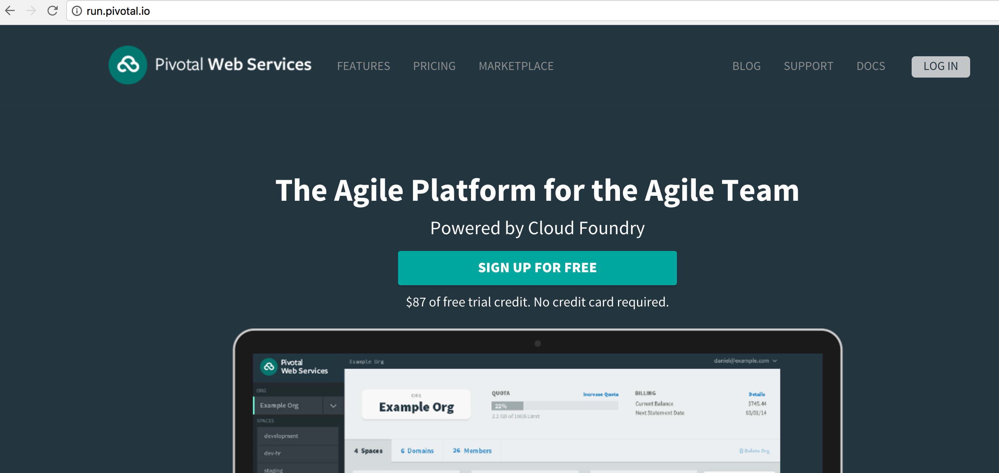
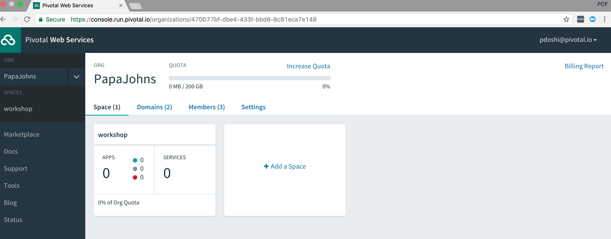

= Lab 0 - Accessing the Workshop Environment

== CF CLI Target and Login

. Download the latest release of the Cloud Foundry CLI from https://console.run.pivotal.io/tools for your operating system and install it.

. From a command prompt, set the API target for the CLI: (set appropriate end point for your environment)
+
----
> cf api https://api.run.pivotal.io
----

. Login to Pivotal Cloud Foundry:
+
----
> cf login
----
+
Follow the prompts, entering the username (email address) and password that you used to register for your account.
+
====
----
> cf login
API endpoint: https://api.run.pivotal.io

Email> pdoshi@pivotal.io

Password>
Authenticating...
OK

Targeted org PapaJohns

Targeted space workshop

API endpoint:   https://api.run.pivotal.io (API version: 2.75.0)
User:           pdoshi@pivotal.io
Org:            PapaJohns
Space:          development

----
====

== AppsManager Login

. Login to Apps Manager URL: http://run.pivotal.io. Click on the Login link. Use the same username and password you entered when using the CF CLI
+
  

. Post Login Screen:

+

