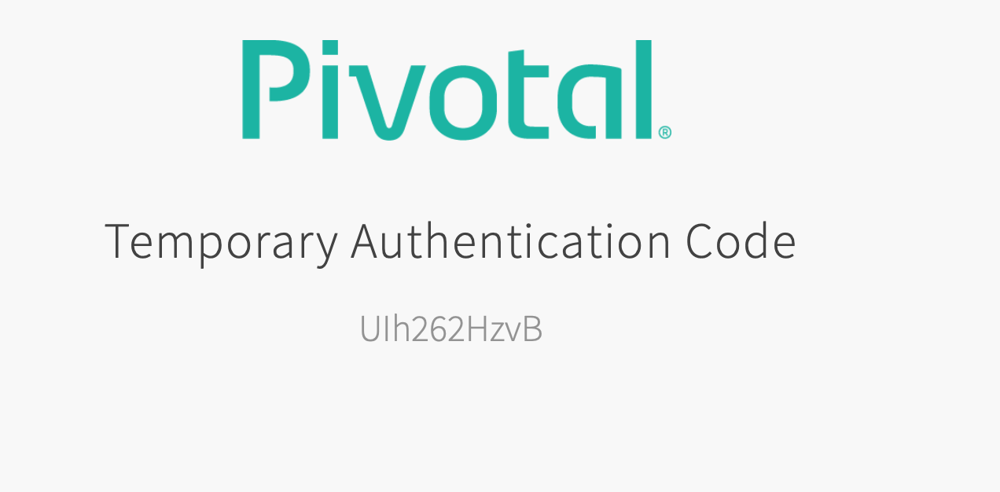
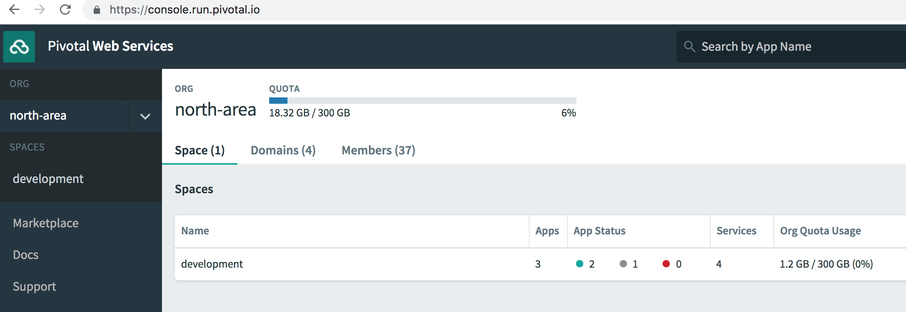

= Lab 0 - Accessing the Workshop Environment

== CF CLI Target and Log In

. Download the latest release of the Cloud Foundry CLI from https://console.run.pivotal.io/tools for your operating system and install it.

. From a command prompt, set the API target for the CLI: (set appropriate end point for your environment)
+
----
> cf api https://api.run.pivotal.io
----

. Log In to Pivotal Cloud Foundry:
+
----
> cf login --sso
----
+
You will be asked to visit a URL similar to the one below and login in to get a temporary passcode.
+
----
cf login --sso
API endpoint: https://api.run.pivotal.io

Temporary Authentication Code ( Get one at https://login.run.pivotal.io/passcode )> 
----
+
When you visit the URL mentioned above, enter your userid and password to get authenticated by your Identity Provider. Post authentication, you will see a passcode shown on the web browser (like shown below). Copy the passcode and paste the passcode on the command prompt/terminal window.
+

+
After entering the passcode, cloud foundry will authenticate it and set your target to your org and space. 
+
----
Temporary Authentication Code ( Get one at https://login.run.pivotal.io/passcode )> 
Authenticating...
OK

Targeted org north-area

Targeted space development

                
API endpoint:   https://api.run.pivotal.io (API version: 2.137.0)
User:           pdoshi@pivotal.io
Org:            north-area
Space:          development
----

== AppsManager Log In

. Log In to Apps Manager URL: http://run.pivotal.io. Click on the 'LOG IN'link in the upper right corner. Use the same username and password you entered when using the CF CLI
+
image::../../Common/images/lab-student-login.png[]  

. Post Log In Screen:

+

