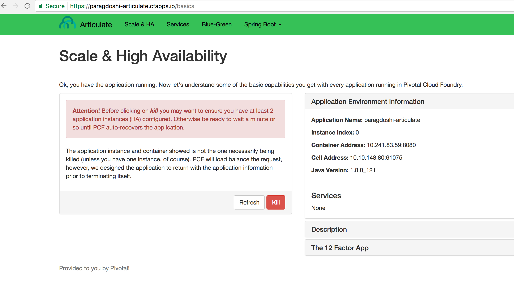
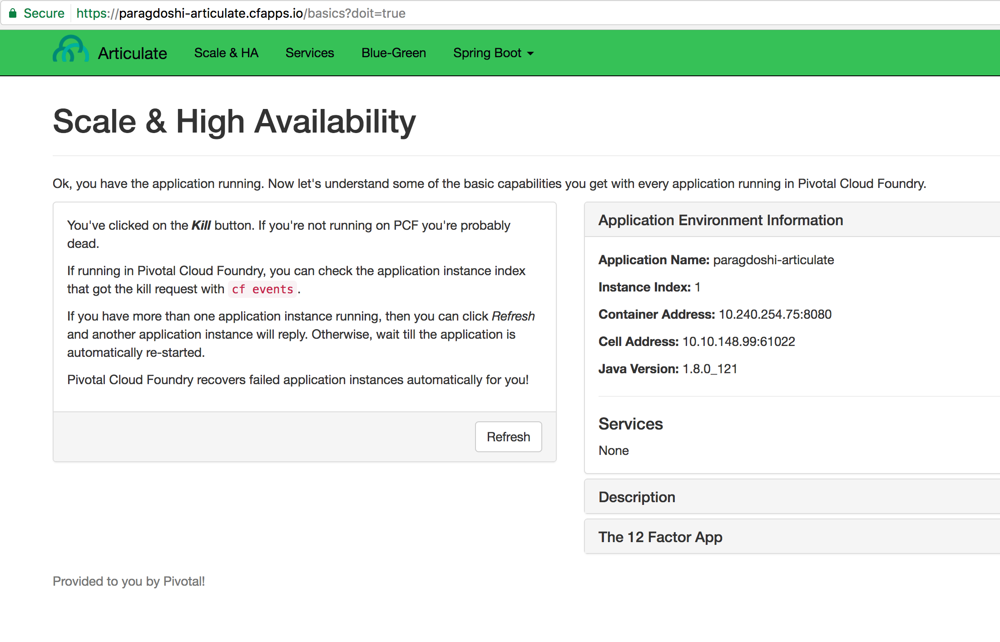
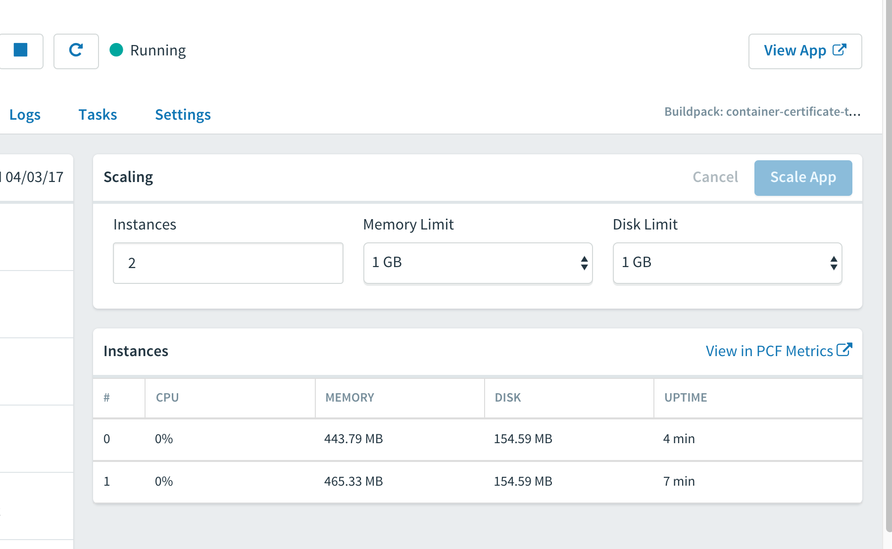
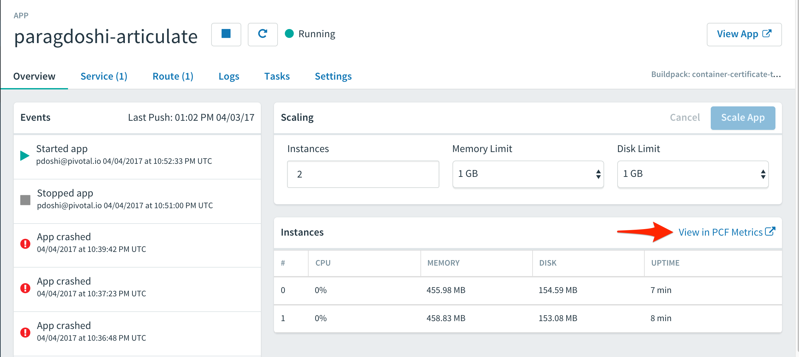
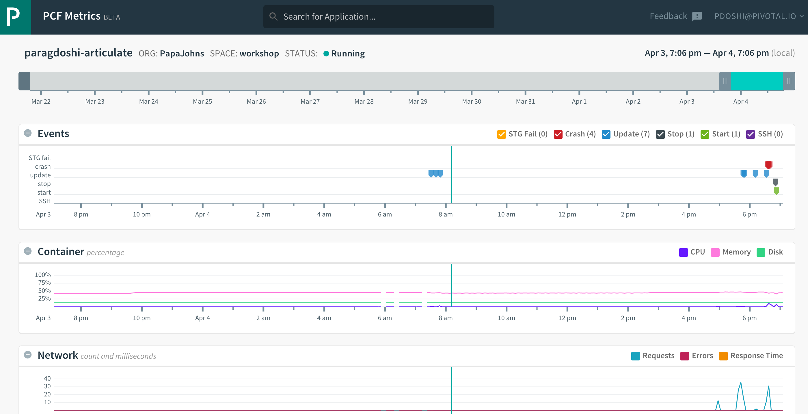

= Lab 3 - Monitoring, Metrics and HA Lab

[abstract]
--
Pivotal Cloud Foundry makes the work of performing actions, such as managing logs, doing a zero-downtime deploy, and managing application health very easy.
In the this labs we'll explore some of these capabilities.
--

== Tailing Application Logs

One of the most important enablers of visibility into application behavior is logging.
Effective management of logs has historically been difficult or required wiring into third party tools.
Cloud Foundry's https://docs.pivotal.io/pivotalcf/1-9/loggregator/architecture.html[log aggregation] components simplify log management by assuming responsibility for it.
Application developers need only log all messages to either 'System.out' in Java or  `STDOUT` or `STDERR` in other languages, and the platform will capture these messages.

=== For Developers

Application developers can view application logs using the CF CLI.

. Let's view recent log messages for the application.
+
----
> cf logs paragdoshi-articulate --recent
----
+
Here are some interesting subsets of one output from that command:
+
.CF Component Logs
====
----
> cf logs paragdoshi-articulate --recent
Retrieving logs for app paragdoshi-articulate in org north-area / space development as pdoshi@pivotal.io...

   2018-10-21T08:02:51.95-0400 [APP/PROC/WEB/1] OUT 2018-10-21 12:02:51.953  INFO 16 --- [           main] org.apache.catalina.core.StandardEngine  : Starting Servlet Engine: Apache Tomcat/8.0.30
   2018-10-21T08:02:52.08-0400 [APP/PROC/WEB/1] OUT 2018-10-21 12:02:52.085  INFO 16 --- [ost-startStop-1] o.a.c.c.C.[Tomcat].[localhost].[/]       : Initializing Spring embedded WebApplicationContext
   2018-10-21T08:02:52.08-0400 [APP/PROC/WEB/1] OUT 2018-10-21 12:02:52.086  INFO 16 --- [ost-startStop-1] o.s.web.context.ContextLoader            : Root WebApplicationContext: initialization completed in 3331 ms
:
:
2018-10-21T08:02:57.75-0400 [RTR/3] OUT paragdoshi-articulate.cfapps.io - [2018-10-21T12:02:57.549+0000] "GET /bluegreen-check HTTP/1.1" 200 0 21 "https://paragdoshi-articulate.cfapps.io/bluegreen" "Mozilla/5.0 (Macintosh; Intel Mac OS X 10_11_6) AppleWebKit/537.36 (KHTML, like Gecko) Chrome/69.0.3497.100 Safari/537.36" "10.10.66.181:10624" "10.10.149.107:61216" x_forwarded_for:"50.5.164.229, 10.10.66.181" x_forwarded_proto:"https" vcap_request_id:"07efcdbf-56d2-431e-51c2-dee0a7b2fc9c" response_time:0.200678981 app_id:"f2fba0f2-7d04-477c-ba59-4d06ccb9706b" app_index:"1" x_b3_traceid:"f4ace69f310b34a0" x_b3_spanid:"f4ace69f310b34a0" x_b3_parentspanid:"-"
:
:
2018-10-21T08:02:59.32-0400 [CELL/0] OUT Container became healthy

----
<1> An ``Apache-style'' access log event from the (Go)Router
<2> An API log event that corresponds to an event as shown in `cf events`
<3> A CELL log event indicating the start of an application instance on that CELL.
====

As you can see, Cloud Foundry's log aggregation components capture both application logs and CF component logs relevant to your application.
These events are properly interwoven based on time, giving you an accurate picture of events as they transpired across the system. 

. To get a running ``tail'' of the application logs rather than a dump, simply type:
+
----
> cf logs paragdoshi-articulate
Retrieving logs for app paragdoshi-articulate in org north-area / space development as pdoshi@pivotal.io...
----
+
You can try various things like refreshing the browser and triggering stop/start events to see logs being generated.

== Health Management

Cloud Foundry's https://docs.pivotal.io/pivotalcf/1-9/concepts/architecture/#nsync-bbs[components] actively monitors the health of our application processes and will restart them should they crash.

. If you don't have one already running, start a log tail for your articulate application. 
+
----
> cf logs paragdoshi-articulate
Connected, tailing logs for app paragdoshi-articulate in org PapaJohns / space workshop as pdoshi@pivotal.io...
----

. If you do not have more than one application instance running, execute the scale command to scale to 2 or more application instances.  Visit the application in the browser, click on 'Scale & HA' link and click on the `Kill' button. This button will trigger an Environment.Exit(-1) causing the Health Manager to observe an application instance crash:
+

. After clicking the kill  a couple of interesting things should happen.
First, you'll see that the application continues to service requests as all requests will now be serviced by the remaining instance (#1 in this example)
+

+
Also, if you're paying attention to the log tail, you'll see some interesting log messages fly by:
+
====
----
2017-04-04T18:39:37.37-0400 [APP/PROC/WEB/0]OUT 2017-04-04 22:39:37.375  WARN 17 --- [nio-8080-exec-8] i.p.e.a.controller.ArticulateController  : *** The system is shutting down. ***
2017-04-04T18:39:37.37-0400 [APP/PROC/WEB/0]OUT 2017-04-04 22:39:37.377  WARN 17 --- [       Thread-5] i.p.e.a.controller.ArticulateController  : killing shortly Thread-5
2017-04-04T18:39:37.73-0400 [RTR/4]      OUT paragdoshi-articulate.cfapps.io - [2017-04-04T22:39:37.721+0000] "GET /images/basics1.png HTTP/1.1" 200 0 167920 "https://paragdoshi-articulate.cfapps.io/basics?doit=true" "Mozilla/5.0 (Macintosh; Intel Mac OS X 10_11_6) AppleWebKit/537.36 (KHTML, like Gecko) Chrome/56.0.2924.87 Safari/537.36" "10.10.2.141:1538" "10.10.148.81:61131" x_forwarded_for:"208.102.173.112" x_forwarded_proto:"https" vcap_request_id:"f130b6ae-3022-4173-49ae-592158159480" response_time:0.009626627 app_id:"8e5b3fd9-272b-41bc-8a5e-b08528e06da0" app_index:"1" x_b3_traceid:"916cefcd630e8d4b" x_b3_spanid:"916cefcd630e8d4b" x_b3_parentspanid:"-"
2017-04-04T18:39:42.38-0400 [APP/PROC/WEB/0]OUT 2017-04-04 22:39:42.377  WARN 17 --- [       Thread-5] i.p.e.a.controller.ArticulateController  : killed Thread-5
2017-04-04T18:39:42.65-0400 [APP/PROC/WEB/0]OUT Exit status 0
2017-04-04T18:39:42.66-0400 [CELL/0]     OUT Exit status 0
2017-04-04T18:39:42.69-0400 [CELL/0]     OUT Destroying container
2017-04-04T18:39:42.71-0400 [API/4]      OUT App instance exited with guid 8e5b3fd9-272b-41bc-8a5e-b08528e06da0 payload: {"instance"=>"", "index"=>0, "reason"=>"CRASHED", "exit_description"=>"2 error(s) occurred:\n\n* 2 error(s) occurred:\n\n* Codependent step exited\n* cancelled\n* cancelled", "crash_count"=>2, "crash_timestamp"=>1491345582680005783, "version"=>"e0e40fba-3195-432b-9c0f-5eec45f150d2"}

----
<1> Just before issuing the `Environment.Exit(-1)` call, the application logs that the kill switch was clicked.
<2> The (Go)Router routes requests to the remaining app instance.
<3> The API logs that an application instance exited due to a crash.
====

. Wait a few seconds...  By this time you should have noticed some additional interesting events in the logs:
+
====
----
2017-04-04T18:39:43.07-0400 [CELL/0]     OUT Creating container
2017-04-04T18:39:43.39-0400 [CELL/0]     OUT Successfully destroyed container
2017-04-04T18:39:46.67-0400 [CELL/0]     OUT Starting health monitoring of container
2017-04-04T18:39:37.48-0400 [RTR/0]      OUT paragdoshi-articulate.cfapps.io - [2017-04-04T22:39:37.473+0000] "GET /webjars/morrisjs/0.5.1/morris.css HTTP/1.1" 200 0 433 "https://paragdoshi-articulate.cfapps.io/basics?doit=true" "Mozilla/5.0 (Macintosh; Intel Mac OS X 10_11_6) AppleWebKit/537.36 (KHTML, like Gecko) Chrome/56.0.2924.87 Safari/537.36" "10.10.2.141:43497" "10.10.147.161:61134" x_forwarded_for:"208.102.173.112" x_forwarded_proto:"https" vcap_request_id:"994f45d5-37f2-4f94-79ad-6958b21cb0c5" response_time:0.007814256 app_id:"8e5b3fd9-272b-41bc-8a5e-b08528e06da0" app_index:"0" x_b3_traceid:"2814b159395e4a17" x_b3_spanid:"2814b159395e4a17" x_b3_parentspanid:"-"
2017-04-04T18:39:49.05-0400 [APP/PROC/WEB/0]OUT 2017-04-04 22:39:49.046  INFO 14 --- [           main] i.p.e.articulate.ArticulateApplication   : The following profiles are active: cloud
2017-04-04T18:39:49.02-0400 [APP/PROC/WEB/0]OUT 2017-04-04 22:39:49.028  INFO 14 --- [           main] nfigurationApplicationContextInitializer : Adding cloud service auto-reconfiguration to ApplicationContext
2017-04-04T18:39:49.04-0400 [APP/PROC/WEB/0]OUT 2017-04-04 22:39:49.046  INFO 14 --- [           main] i.p.e.articulate.ArticulateApplication   : Starting ArticulateApplication on e1444c83-4b34-45e7-42ad-10e2ecac6b67 with PID 14 (/home/vcap/app started by vcap in /home/vcap/app)
2017-04-04T18:39:49.87-0400 [APP/PROC/WEB/0]OUT 2017-04-04 22:39:49.873  INFO 14 --- [           main] urceCloudServiceBeanFactoryPostProcessor : No beans of type javax.sql.DataSource found. Skipping auto-reconfiguration.
2017-04-04T18:39:49.86-0400 [APP/PROC/WEB/0]OUT 2017-04-04 22:39:49.869  INFO 14 --- [           main] urceCloudServiceBeanFactoryPostProcessor : Auto-reconfiguring beans of type javax.sql.DataSource

----
<1> The CELL indicates that it is starting another instance of the application as a result of the Health Manager observing a difference between the desired and actual state (i.e. running instances = 1 vs. running instances = 0).
<2> The new application instance starts logging events as it starts up.
====
Hit CTRL + C to stop tailing the logs.

. Revisiting the *HOME PAGE* of the application and you should see a fresh instance started:
+

== Viewing Application _Events_

Cloud Foundry only allows application configuration to be modified via its API.
This gives application operators confidence that all changes to application configuration are known and auditable.
It also reduces the number of causes that must be considered when problems arise.

All application configuration changes are recorded as _events_.
These events can be viewed via the Cloud Foundry API, and viewing is facilitated via the CLI.

Take a look at the events that have transpired so far for our deployment of `workshop`:

====
----
> cf events paragdoshi-articulate
Getting events for app paragdoshi-articulate in org PapaJohns / space workshop as pdoshi@pivotal.io...

time                          event                   actor                   description
2017-04-04T18:36:48.00-0400   audit.app.process.crash   web                   index: 0, reason: CRASHED, exit_description: 2 error(s) occurred:

                                                                               * 2 error(s) occurred:

                                                                              * Codependent step exited
                                                                              * cancelled
                                                                              * cancelled
                                                                     
2017-04-04T18:32:52.00-0400   audit.app.update          pdoshi@pivotal.io       instances: 2
2017-04-04T18:11:07.00-0400   audit.app.update          pdoshi@pivotal.io
2017-04-04T18:11:07.00-0400   audit.app.map-route       pdoshi@pivotal.io
2017-04-04T17:50:05.00-0400   audit.app.update          pdoshi@pivotal.io
2017-04-04T17:50:04.00-0400   audit.app.unmap-route     pdoshi@pivotal.io
2017-04-04T17:47:04.00-0400   audit.app.update          pdoshi@pivotal.io       instances: 1
2017-04-04T07:48:59.00-0400   audit.app.update          autoscaling_service     instances: 2
2017-04-04T07:40:41.00-0400   audit.app.update          pdoshi@pivotal.io       instances: 1
2017-04-04T07:30:55.00-0400   audit.app.update          autoscaling_service     instances: 2
2017-04-03T15:27:12.00-0400   audit.app.update          pdoshi@pivotal.io       instances: 1
2017-04-03T14:46:37.00-0400   audit.app.update          pdoshi@pivotal.io       instances: 3
2017-04-03T13:03:07.00-0400   audit.app.update          pdoshi@pivotal.io       state: STARTED
2017-04-03T13:02:44.00-0400   audit.app.update          pdoshi@pivotal.io
2017-04-03T13:02:44.00-0400   audit.app.map-route       pdoshi@pivotal.io
2017-04-03T13:02:43.00-0400   audit.app.create          pdoshi@pivotal.io       disk_quota: 1024, instances: 1, memory: 1024, state: STOPPED, environment_json: PRIVATE DATA HIDDEN
----
<1> Events are sorted newest to oldest, so we'll start from the bottom.
Here we see the `app.create` event, which created our application's record and stored all of its metadata (e.g. `memory: 1024`).
<2> The `app.map-route` event records the incoming request to assign a route to our application.
<3> An `app.update` event records the resulting change to our applications metadata.
<4> An `app.update` event records the change of our application's state to `STARTED`.
<5> Remember scaling the application up? An `app.update` event records the metadata change `instances: 2`.
<6> Also there's the `app.process.crash` event recording that we encountered a crash of an application instance.
====

. Let's explicitly ask for the application to be stopped:
+
----
> cf stop paragdosh-articulate
Stopping app paragdoshi-articulate in org PapaJohns / space workshop as pdoshi@pivotal.io...
OK

----

. Now, examine the additional `app.update` event:
+
----
> cf events paragdoshi-articulate
Getting events for app paragdoshi-articulate in org PapaJohns / space workshop as pdoshi@pivotal.io...

ttime                          event                     actor                   description
2017-04-04T18:51:00.00-0400   audit.app.update          pdoshi@pivotal.io       state: STOPPED
2017-04-04T18:39:42.00-0400   app.crash                 paragdoshi-articulate   index: 0, reason: CRASHED, exit_description: 2 error(s) occurred:

                                                                                * 2 error(s) occurred:

                                                                                * Codependent step exited
                                                                                * cancelled
                                                                                * cancelled

----

. Start the application again:
+
----
> cf start paragdoshi-articulate
Starting app paragdoshi-articulate in org PapaJohns / space workshop as pdoshi@pivotal.io...

0 of 2 instances running, 2 starting
0 of 2 instances running, 2 starting
0 of 2 instances running, 2 starting
0 of 2 instances running, 2 starting
0 of 2 instances running, 2 starting
0 of 2 instances running, 2 starting
1 of 2 instances running, 1 starting

App started

OK

App paragdoshi-articulate was started using this command `CALCULATED_MEMORY=$($PWD/.java-buildpack/open_jdk_jre/bin/java-buildpack-memory-calculator-2.0.2_RELEASE -memorySizes=metaspace:64m..,stack:228k.. -memoryWeights=heap:65,metaspace:10,native:15,stack:10 -memoryInitials=heap:100%,metaspace:100% -stackThreads=300 -totMemory=$MEMORY_LIMIT) && JAVA_OPTS="-Djava.io.tmpdir=$TMPDIR -XX:OnOutOfMemoryError=$PWD/.java-buildpack/open_jdk_jre/bin/killjava.sh $CALCULATED_MEMORY -Djavax.net.ssl.trustStore=$PWD/.java-buildpack/container_certificate_trust_store/truststore.jks -Djavax.net.ssl.trustStorePassword=java-buildpack-trust-store-password" && SERVER_PORT=$PORT eval exec $PWD/.java-buildpack/open_jdk_jre/bin/java $JAVA_OPTS -cp $PWD/. org.springframework.boot.loader.JarLauncher`

Showing health and status for app paragdoshi-articulate in org PapaJohns / space workshop as pdoshi@pivotal.io...
OK

requested state: started
instances: 2/2
usage: 1G x 2 instances
urls: paragdoshi-articulate.cfapps.io
last uploaded: Mon Apr 3 17:02:55 UTC 2017
stack: cflinuxfs2
buildpack: container-certificate-trust-store=2.0.0_RELEASE java-buildpack=v3.14-offline-https://github.com/cloudfoundry/java-buildpack.git#d5d58c6 java-main open-jdk-like-jre=1.8.0_121 open-jdk-like-memory-calculator=2.0.2_RELEASE spring-auto-reconfiguration=1.10...

     state      since                    cpu    memory         disk           details
#0   starting   2017-04-04 06:52:33 PM   0.0%   299.7M of 1G   154.6M of 1G
#1   running    2017-04-04 06:53:06 PM   0.0%   0 of 1G        0 of 1G

----

. And again, view the additional `app.update` event:
+
----
> cf events paragdoshi-articulate
Getting events for app paragdoshi-articulate in org PapaJohns / space workshop as pdoshi@pivotal.io......

time                          event                     actor                   description
2017-04-04T18:52:33.00-0400   audit.app.update          pdoshi@pivotal.io       state: STARTED
2017-04-04T18:51:00.00-0400   audit.app.update          pdoshi@pivotal.io       state: STOPPED
----

== PCF Metrics

. Along with the logs and events streams, application developers and operators have another tool available to them to monitor the health of their applications - PCF Metrics. And this tool can be accessed by clicking the 'View in PCF Metrics' link for your application in PCF. Log in with your credentials if redirected to log in page.
+

. You can view Events, Container and Network metrics and also the logs in one easy to use interface. 
+

This completes the lab for Monitoring, Metrics and HA !

