= Adding Spring Cloud Config to Boot Application

In this lab we'll utilize Spring Boot and Spring Cloud to configure our application from a configuration dynamically retrieved from a git repository. We'll then deploy it to Pivotal Cloud Foundry and auto-provision an instance of a configuration server using Pivotal Spring Cloud Services.

== Import Starter Project in Intellij

in your git clone directory, there will be a sub-directory named 'starter-project'. In that directory, there will be a zip archive file named 'SCSApp.zip'. Un-zip that file into any directory. After un-zipping that file, import it as a Maven project in Intellij by following these steps:

. Start Intellij and use the 'Import Project option':

+
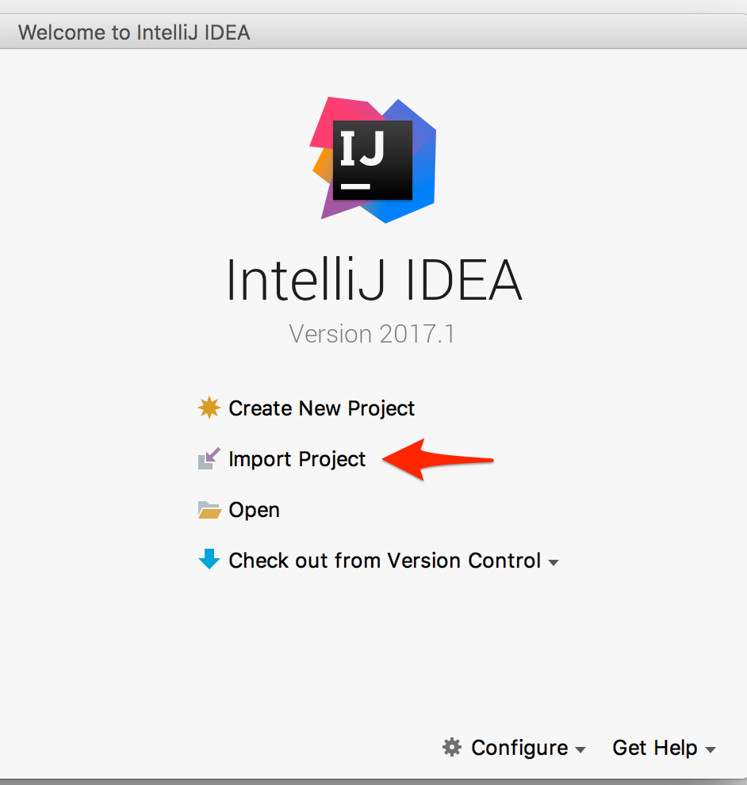

. In the project selection step, navigate to your directory where you un-zipped the file and select 'SCSApp':

+
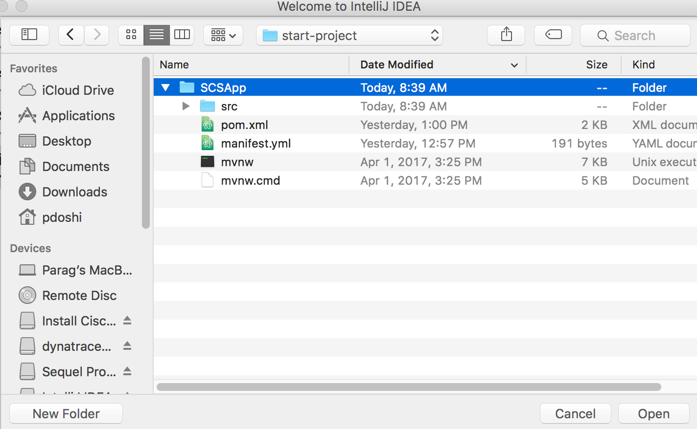 

. In the Import Project step, select 'Import Project from external model' and select Maven:

+
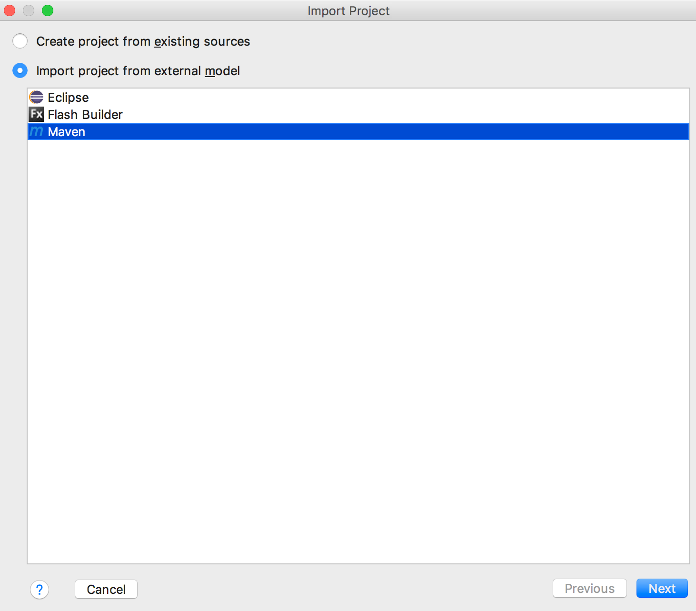 

. In the Project Settings page, retain all the defaults and click Next:

+
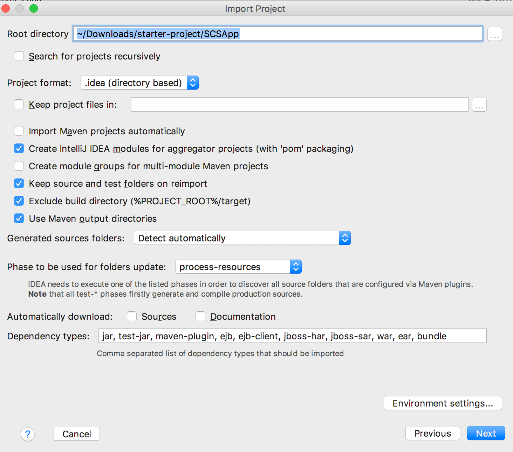 

. In the Select Maven Projects to Import step, select the com.example.scsapp:0.0.1-SNAPSHOT :

+
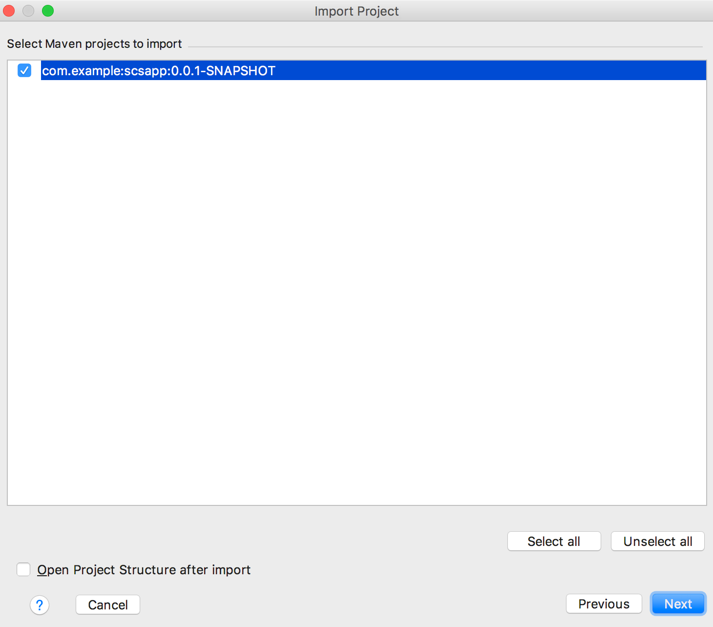 

. Select 1.8 JDK and click Next:

+
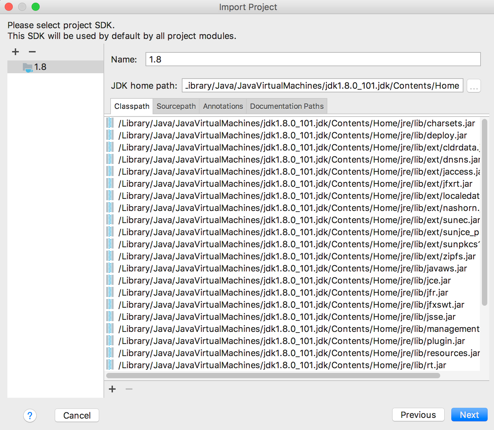 

. Enter project name 'scsapp', select your project file location and click Finish:

+
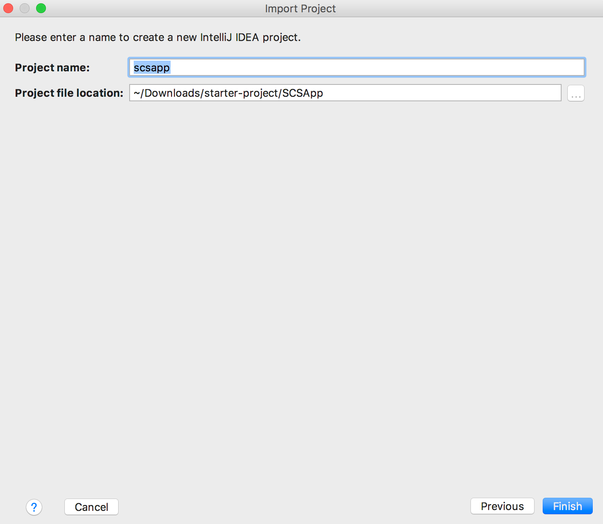

. The scsapp project should get loaded and take you to the project view. Click on 'Build' menu and select 'Build Project' to ensure there are no compilation errors:

+
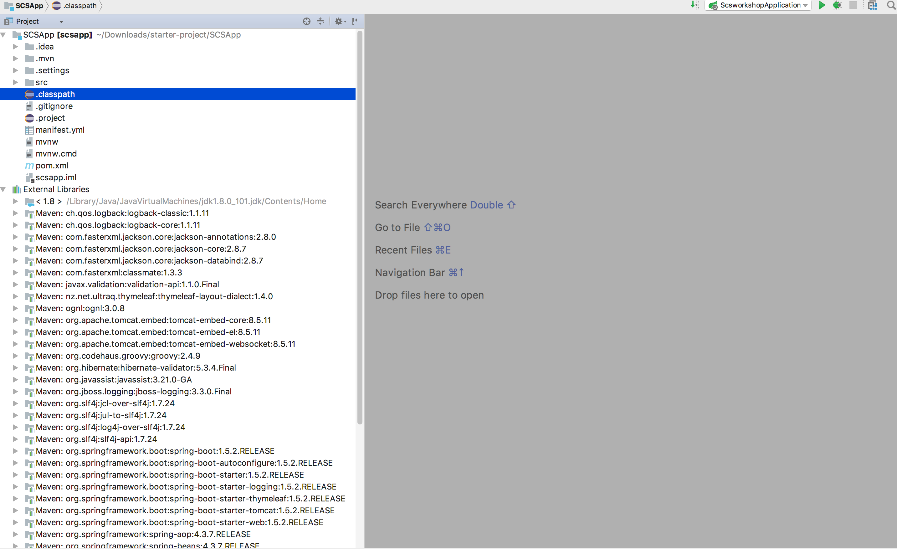

. Navigate to 'View - Tool Windows - Maven Projects' and run the 'package' command. This should generate the scsapp-0.0.1-SNAPSHOT.jar' in the 'target' folder:
+
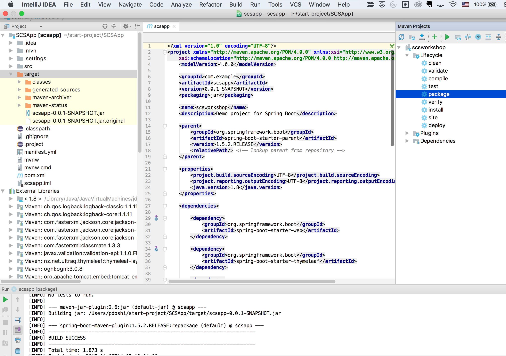

. Open the manifest.yml file and change the app name to include your unique user name:
+
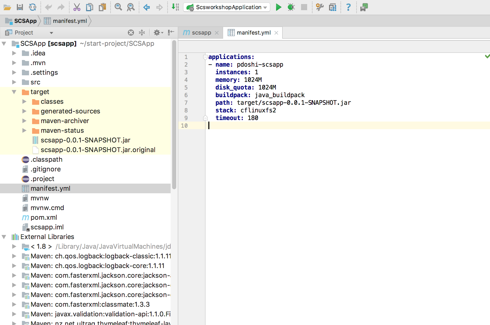

== Push to CF

. Navigate to the project directory on the command prompt and run the 'cf push' command:

+
-----
pdoshi@Parags-MacBook-Pro:~/Downloads/starter-project/SCSApp$ cf push
Using manifest file /Users/pdoshi/Downloads/starter-project/SCSApp/manifest.yml

Using stack cflinuxfs2...
OK
Updating app pdoshi-scsapp in org PapaJohns / space workshop as pdoshi@pivotal.io...
OK

Uploading pdoshi-scsapp...
Uploading app files from: /var/folders/1w/mpbw8_5s2_j491wwnlcc7vv40000gn/T/unzipped-app874964493
Uploading 347.3K, 96 files
Done uploading               
OK

Stopping app pdoshi-scsapp in org PapaJohns / space workshop as pdoshi@pivotal.io...
OK

Starting app pdoshi-scsapp in org PapaJohns / space workshop as pdoshi@pivotal.io...
Downloading java_buildpack...
Downloaded java_buildpack
Creating container
Successfully created container
Downloading build artifacts cache...
Downloading app package...
Downloaded app package (18.6M)
-----> Java Buildpack Version: v3.14 (offline) | https://github.com/cloudfoundry/java-buildpack.git#d5d58c6
-----> Downloading Open Jdk JRE 1.8.0_121 from https://java-buildpack.cloudfoundry.org/openjdk/trusty/x86_64/openjdk-1.8.0_121.tar.gz (found in cache)
       Expanding Open Jdk JRE to .java-buildpack/open_jdk_jre (1.5s)
-----> Downloading Open JDK Like Memory Calculator 2.0.2_RELEASE from https://java-buildpack.cloudfoundry.org/memory-calculator/trusty/x86_64/memory-calculator-2.0.2_RELEASE.tar.gz (found in cache)
       Memory Settings: -Xms681574K -Xss349K -Xmx681574K -XX:MaxMetaspaceSize=104857K -XX:MetaspaceSize=104857K
-----> Downloading Container Certificate Trust Store 2.0.0_RELEASE from https://java-buildpack.cloudfoundry.org/container-certificate-trust-store/container-certificate-trust-store-2.0.0_RELEASE.jar (found in cache)
       Adding certificates to .java-buildpack/container_certificate_trust_store/truststore.jks (0.8s)
-----> Downloading Spring Auto Reconfiguration 1.10.0_RELEASE from https://java-buildpack.cloudfoundry.org/auto-reconfiguration/auto-reconfiguration-1.10.0_RELEASE.jar (found in cache)
Exit status 0
Uploading droplet, build artifacts cache...
Uploading build artifacts cache...
Uploading droplet...
Uploaded build artifacts cache (109B)
Uploaded droplet (64M)
Uploading complete
Destroying container
Successfully destroyed container

0 of 1 instances running, 1 starting
1 of 1 instances running

App started

OK

App pdoshi-scsapp was started using this command `CALCULATED_MEMORY=$($PWD/.java-buildpack/open_jdk_jre/bin/java-buildpack-memory-calculator-2.0.2_RELEASE -memorySizes=metaspace:64m..,stack:228k.. -memoryWeights=heap:65,metaspace:10,native:15,stack:10 -memoryInitials=heap:100%,metaspace:100% -stackThreads=300 -totMemory=$MEMORY_LIMIT) && JAVA_OPTS="-Djava.io.tmpdir=$TMPDIR -XX:OnOutOfMemoryError=$PWD/.java-buildpack/open_jdk_jre/bin/killjava.sh $CALCULATED_MEMORY -Djavax.net.ssl.trustStore=$PWD/.java-buildpack/container_certificate_trust_store/truststore.jks -Djavax.net.ssl.trustStorePassword=java-buildpack-trust-store-password" && SERVER_PORT=$PORT eval exec $PWD/.java-buildpack/open_jdk_jre/bin/java $JAVA_OPTS -cp $PWD/. org.springframework.boot.loader.JarLauncher`

Showing health and status for app pdoshi-scsapp in org PapaJohns / space workshop as pdoshi@pivotal.io...
OK

requested state: started
instances: 1/1
usage: 1G x 1 instances
urls: pdoshi-scsapp.cfapps.io
last uploaded: Sat Apr 8 18:41:22 UTC 2017
stack: cflinuxfs2
buildpack: java_buildpack

     state     since                    cpu    memory         disk           details
#0   running   2017-04-08 02:42:25 PM   0.0%   378.9M of 1G   142.8M of 1G

-----

. Navigate to your scsapp in a browser and you should see a simple html page output, similar to the one below:

+
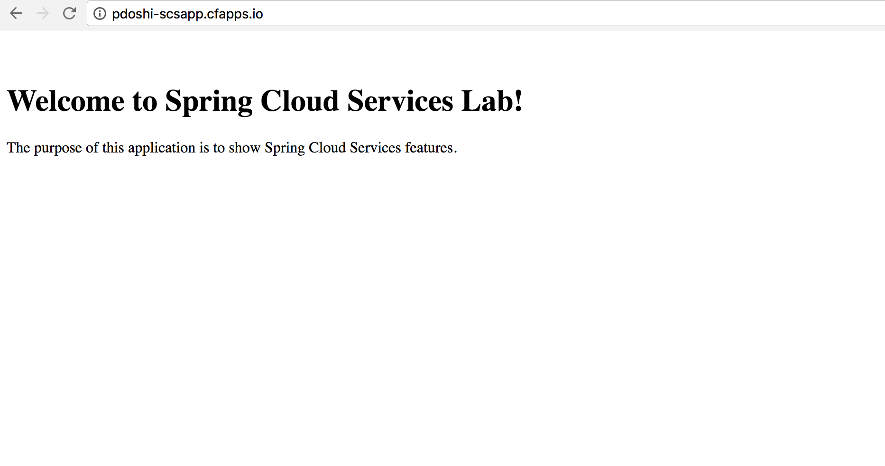

== Add ability to read dynamic Value

Now we will set the groundwork of reading dynamic value in our application. Make the following changes:

. In the ServiceController.java, add the following snippet of code above the index() REST service method which will create a variable _greeting and store a default value of "Hi":
+
-----
@Value("${greeting:Hi}")
	private String _greeting;
-----

. In the ServiceController.java, update the index() REST service method to store the value of _greeting in the model object:

+
-----
model.addAttribute("greeting", _greeting);
-----

The complete ServiceController.java will look like this:

-----
package com.example;

import javax.servlet.http.HttpServletRequest;

import org.springframework.stereotype.Controller;
import org.springframework.ui.Model;
import org.springframework.web.bind.annotation.RequestMapping;
import org.springframework.beans.factory.annotation.Value;

@Controller
public class ServicesController {

	@Value("${greeting:Hi}")
	private String _greeting;

	
	@RequestMapping("/")
	public String index(HttpServletRequest request, Model model) throws Exception {
		model.addAttribute("greeting", _greeting);
		return "index";
	}
}
-----

. Override the default value of "Hi" in the applications.properties by adding this line:

-----
greeting="Hello"
-----

. Run the 'package' task of Maven, go to the command prompt and 'cf push' the application. Refreshing the browser should show the dynamic value of greeting:
+
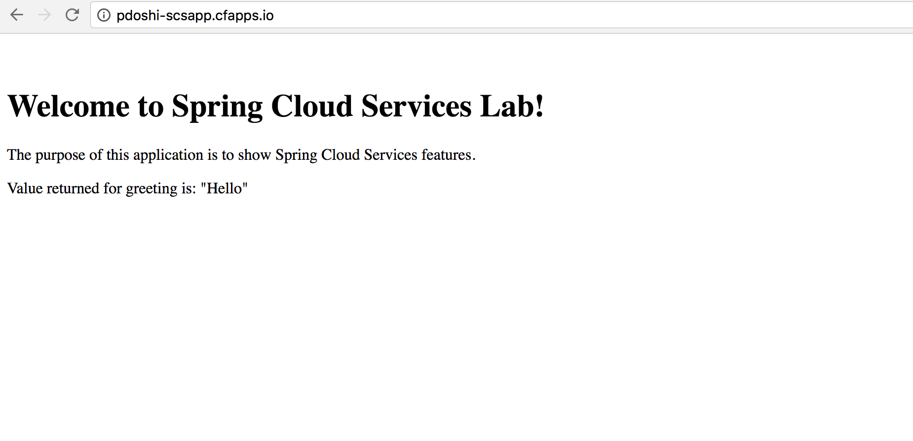

== Add Spring Config functionality
Now we will add the functionality to read the 'greeting' value from a git repo that is backed by Spring Cloud Config service. Make the following changes to the application:

. Open your Maven POM file and add the following dependencies to enable SCS and actuator end-point so we can see the environment values returned for the config service:

+
[source, xml]
-----
<dependency>
	<groupId>io.pivotal.spring.cloud</groupId>
	<artifactId>spring-cloud-services-dependencies</artifactId>
	<version>1.4.1.RELEASE</version>
	<type>pom</type>
</dependency>
<dependency>
	<groupId>org.springframework.cloud</groupId>
	<artifactId>spring-cloud-dependencies</artifactId>
	<version>Brixton.SR7</version>
	<type>pom</type>
</dependency>
<dependency>
	<groupId>org.springframework.cloud</groupId>
	<artifactId>spring-cloud-commons</artifactId>
	<version>1.1.8.RELEASE</version>
</dependency>
<dependency>
	<groupId>io.pivotal.spring.cloud</groupId>
	<artifactId>spring-cloud-services-starter-config-client</artifactId>
	<version>1.4.1.RELEASE</version>
</dependency>
<dependency>
	<groupId>org.springframework.boot</groupId>
	<artifactId>spring-boot-starter-actuator</artifactId>
</dependency>

-----

. When we introduced the Spring Cloud Services Starter Config Client dependency Spring Security will also be included (Config servers will be protected by OAuth2).  However, this will also enable basic authentication to all our service endpoints.  Add the following configuration to *application.properties*:

+
---------------------------------------------------------------------
security.basic.enabled=false
---------------------------------------------------------------------

. We'll also want to give our Spring Boot App a name so that it can lookup application-specific configuration from the config server later.  Add the following configuration to *application.properties*:

+
---------------------------------------------------------------------
spring.application.name=pdoshi-scsapp
---------------------------------------------------------------------

. To simplify working with the endpoint for this lab, we will turn off additional security for the health endpoint. Add the following to *application.properties*:

------
management.security.enabled=false
------

. Complete application.properties
+
---------------------------------------------------------------------
greeting="Hello"
security.basic.enabled=false
spring.application.name=pdoshi-scsapp
management.security.enabled=false
---------------------------------------------------------------------

. Next step is to create the Spring Config Server service instance and bind it to our application. To create the config server instance, navigate to Marketplace in your App Manager and click on 'Config Server' service:
+
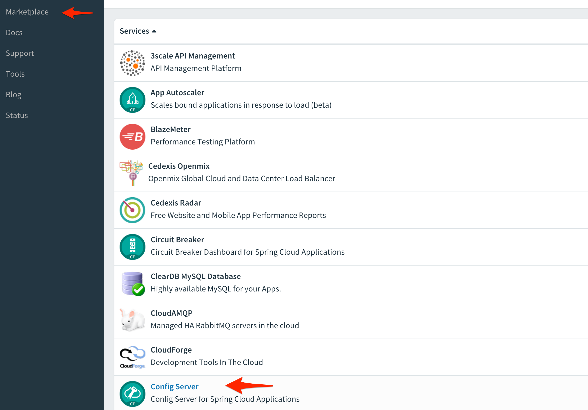

. In the resulting details page, select the _standard_, single tenant plan.  give it a unique name, select the 'workspace' space that you've been using to push all your applications.  At this time you don't need to select a application to bind to the service:
+
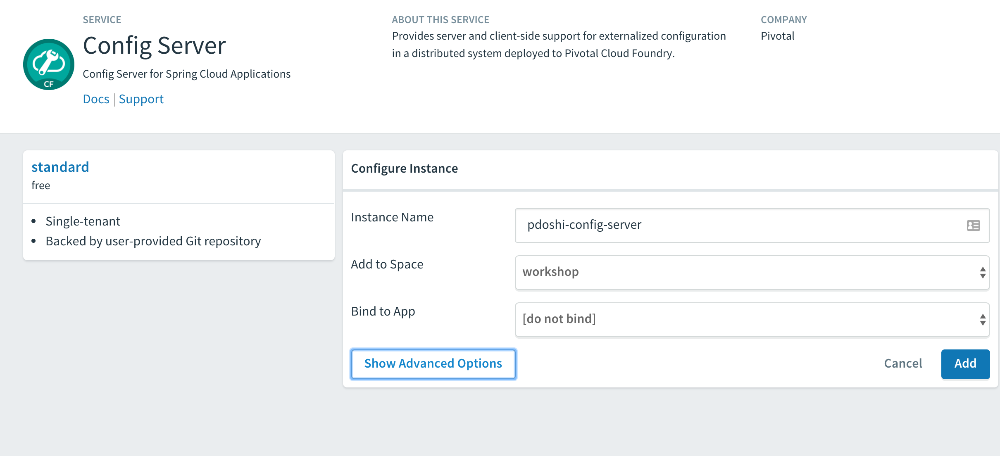

. After we create the service instance you'll be redirected to your _Space_ landing page that lists your apps and services.  The config server is deployed on-demand and will take a few moments to deploy.  

+
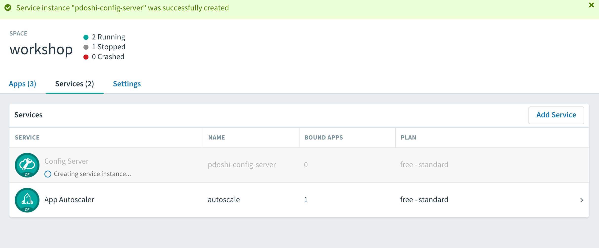

. Once the messsage _The Service Instance is Initializing_ disappears click on the service you provisioned.  Select the manage link towards the top of the resulting screen to view the instance id and a JSON document with a single element, count, which validates that the instance provisioned correctly:

+
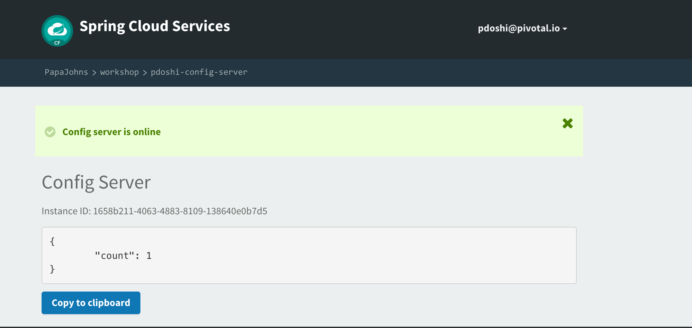

. We now need to update the service instance with our GIT repository information.  Using the cloudfoundry CLI execute the following update service command:
+
[source,bash]
---------------------------------------------------------------------
$ cf update-service pdoshi-config-server -c '{"git": { "uri": "https://github.com/git-paragdoshi/config-repo" } }'
---------------------------------------------------------------------

. The command will provide the following update:

+
[source,bash]
---------------------------------------------------------------------
Updating service instance pdoshi-config-server as pdoshi@pivotal.io...
OK

Update in progress. Use 'cf services' or 'cf service pdoshi-config-server' to check operation status.
pdoshi@Parags-MacBook-Pro:~/start-project/SCSApp$ cf service pdoshi-config-server 

Service instance: pdoshi-config-server
Service: p-config-server
Bound apps: 
Tags: 
Plan: standard
Description: Config Server for Spring Cloud Applications
Documentation url: http://docs.pivotal.io/spring-cloud-services/
Dashboard: https://spring-cloud-service-broker.cfapps.io/dashboard/p-config-server/1658b211-4063-4883-8109-138640e0b7d5

Last Operation
Status: update in progress
Message: 
Started: 2017-04-09T00:27:45Z
Updated: 2017-04-09T00:27:57Z

---------------------------------------------------------------------

. Refresh you Config Server management page and you will see the following message.  Wait until the screen refreshes and the service is reintialized:

+
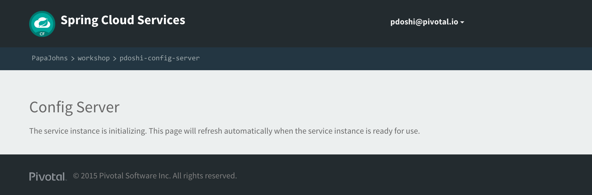

. After the service completes the the re-initialzing, you should see the the git uri updated on the config page:

+
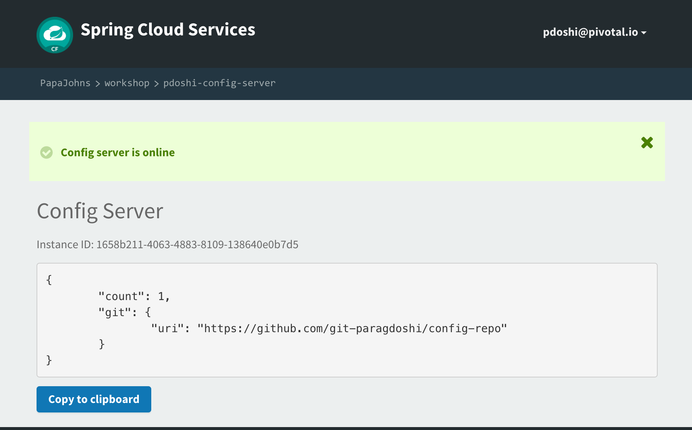

. We will now bind our application to our config-server within our Cloudfoundry deployment manifest.  Add these 2 entries to the bottom of *manifest.yml*
+
[source, yml]
---------------------------------------------------------------------
 services:
  - pdoshi-config-server
---------------------------------------------------------------------

. Complete manifest file will look like this:

+
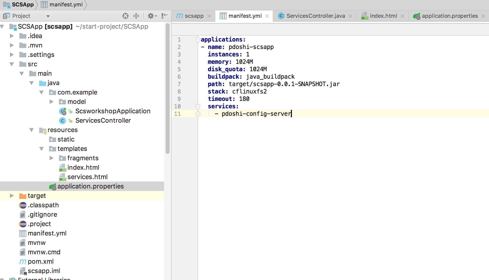

. Run the Maven 'package' command for your application and 'cf push' the application from the command prompt. Watch for the 'Binding service..' status in the cf push output. It will look something similar to this:

-----
:
Binding service pdoshi-config-server to app pdoshi-scsapp in org PapaJohns / space workshop as pdoshi@pivotal.io...
OK
:
-----

== Run Application

. Access your application in the browser and now it should show the 'greeting' value from the config repo:

+
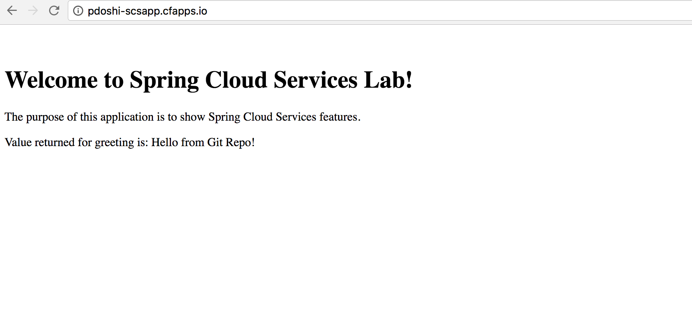

. Another way to check the values coming from the config service is to use the /env endpoint that is provided by Spring Actuator. Hitting this end point for your application, will result in an output similar to this:

+
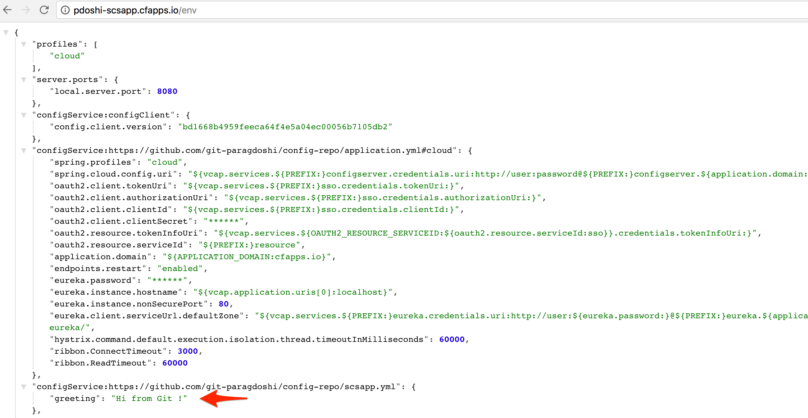

. What just happened??  A Spring component within the Spring Cloud Starter Config Client module called a _service connector_ automatically detected that there was a Cloud Config service bound into the application.  The service connector configured the application automatically to connect to the cloud config server and download the configuration and wire it into the application

. If you navigate to the GIT repo we specified for our configuration, https://github.com/git-paragdoshi/config-repo, you'll see a file named *scsapp.yml*.  This filename is the same as our spring.application.name value for our Boot application.  The configuration is read from this file, in our case the following property:
+
[source, yaml]
---------------------------------------------------------------------
greeting: Hi from Git !
---------------------------------------------------------------------

. Next we'll learn how to register our service with a service registry and load balance requests using Spring Cloud components.
