= MicroServices Registration and Discovery with Spring Cloud Services - Eureka

In this lab we'll utilize Spring Boot and Spring Cloud to configure our application register itself with a service registry.  To do this we'll also need to provision an instance of a Eureka service registry using Pivotal Cloudfoundry Spring Cloud Services.  We'll also extend our application to look up a microservice application (Attendee-Service) from the service registry and makes requests to it.

== Update Attendee-Service to Register with Eureka

. Navigate to */starter-project/spring-cloud-eureka* folder and unzip the *AttendeeServicesApp* zip file. This contains the code needed for the AttendeeService microservice that is backed by a MySQL database.

. In Intellij, click on File -- Open and select 'AttendeeServicesApp' folder. It will open AttendeeServicesApp project:
+
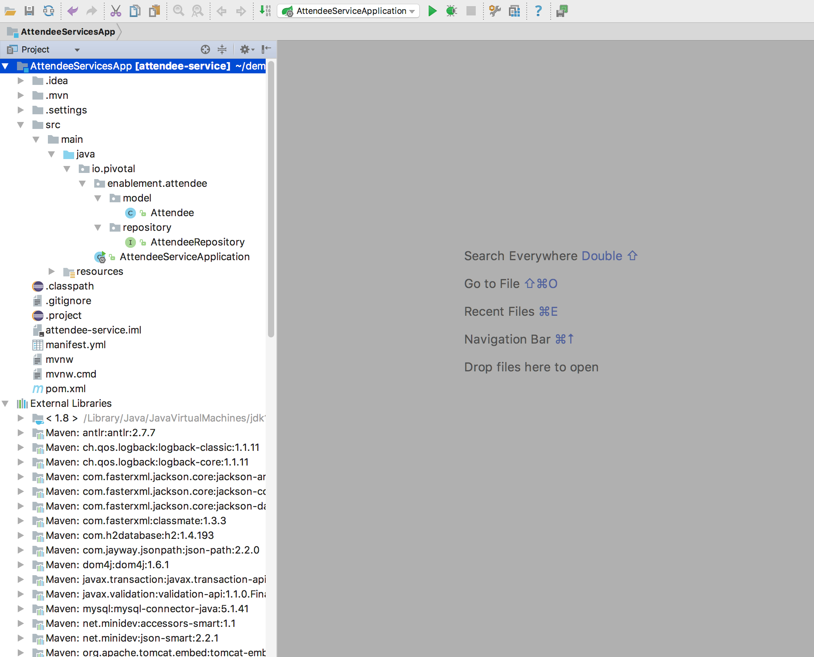

. Open *pom.xml* and add the Spring Cloud Eureka Dependencies. *Update your project so that the libraries are downloaded by Maven*.
+
[source, xml]
-----
		<dependency>
	            <groupId>io.pivotal.spring.cloud</groupId>
	            <artifactId>spring-cloud-services-dependencies</artifactId>
	            <version>1.4.1.RELEASE</version>
	            <type>pom</type>
	        </dependency>
	        <dependency>
	            <groupId>org.springframework.cloud</groupId>
	            <artifactId>spring-cloud-dependencies</artifactId>
	            <version>Brixton.SR7</version>
	            <type>pom</type>
	        </dependency>
	        <dependency>
			    <groupId>org.springframework.cloud</groupId>
			    <artifactId>spring-cloud-commons</artifactId>
			    <version>1.1.8.RELEASE</version>
		</dependency>
		<dependency>
		      <groupId>io.pivotal.spring.cloud</groupId>
		      <artifactId>spring-cloud-services-starter-service-registry</artifactId>
		      <version>1.4.1.RELEASE</version>
    		</dependency>

-----

. Thanks to Spring Cloud instructing your application to register with Eureka is as simple as adding a single annotation to your app! Add an @EnableDiscoveryClient annotation to the *AttendeeServiceApplication.java* as shown below. Import *org.springframework.cloud.client.discovery.EnableDiscoveryClient*.

+
[source, java]
------
@SpringBootApplication
@EnableJpaRepositories
@EnableDiscoveryClient
public class AttendeeServiceApplication {
------
Complete listing of *AttendeeServiceApplication.java*:
+
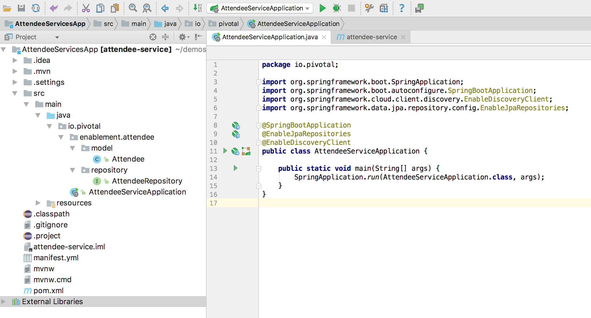

. Update the */src/main/resources/application.yml* with three properties: A unique application name - your service will be bound to Eureka using this name *(in this lab, the name has to be unique, unlike the Spring Cloud Config lab)*, disable basic authentication as we Spring security is enabled by default for Spring Cloud Services and add the ability to auto generate ddl (tables) in our backend database.

+
[source, yml]
-----
security:
  basic:
    enabled: false
spring:
  application:
    name: pdoshi-attendee-service
  jpa:
    generate-ddl: true  
-----

. Open the manifest.yml file and add a unique prefix to the MySQL service instance and add the Eureka service registry instance, with a unique name. Complete listing is shown below:
+
[source, yml]
-----
applications:
- name: pdoshi-attendee-service
  instances: 1
  memory: 1024M
  disk_quota: 1024M
  stack: cflinuxfs2
  path: target/attendee-service-0.0.1-SNAPSHOT.jar
  services:
    - pdoshi-mysql-service
    - pdoshi-service-registry
-----

. Run Maven *clean* and *package* - that should create attendee-service-0.0.1-SNAPSHOT.jar in the /target directory.

+
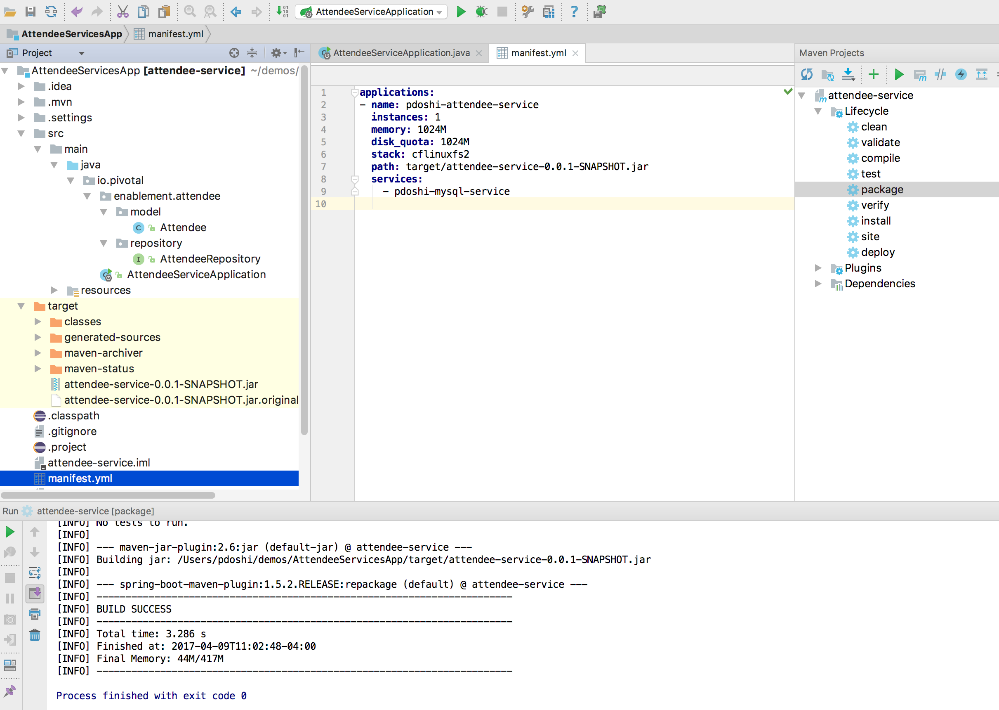

. Navigate to Cloud Foundry App Manager and choose 'Marketplace' link to see list of available services. Choose 'MySQL for Pivotal Cloud Foundry'.

+
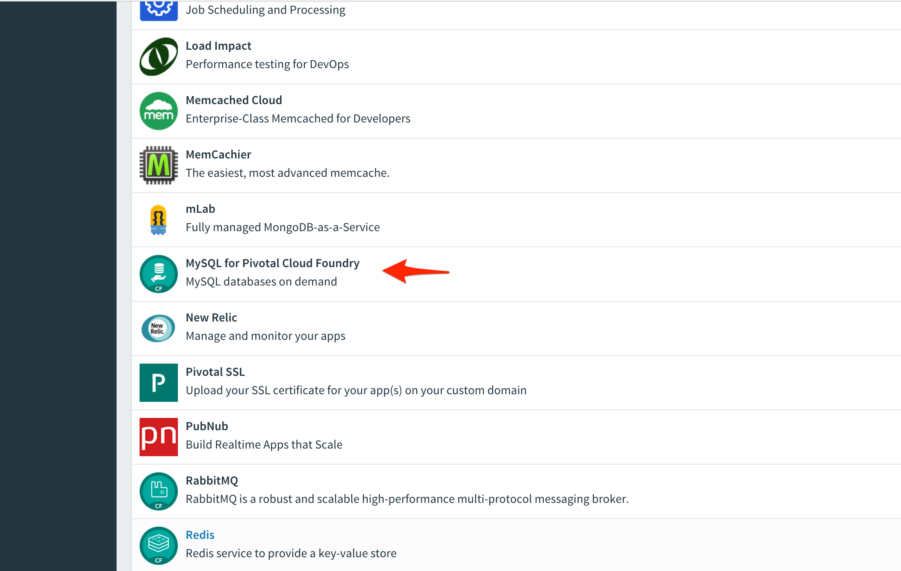

. Select the _100mb_ free plan and click on 'Select this plan' button. Give it the same instance name that you have listed in the *manifest.yml* file. In my example, it is pdoshi-mysql-service. Add it to the 'workshop' space. And do not bind any application at this time.

+
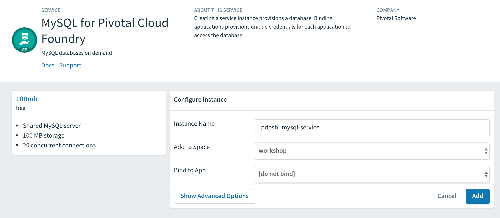

. Now that our application is ready to read registry with an Eureka instance, we need to deploy one! This can be done through cloudfoundry using the services marketplace. Navigate to the Marketplace again and now select *Service Registry* service.
+
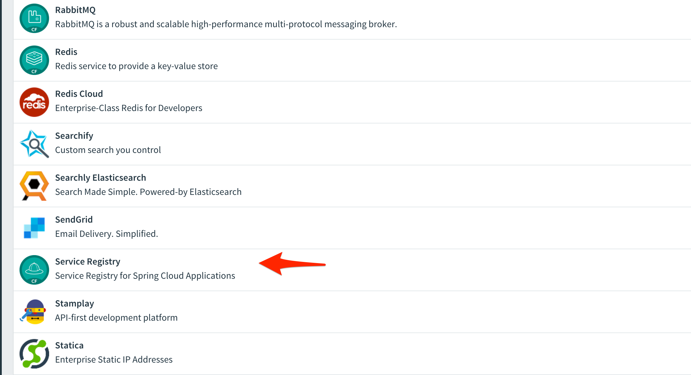

. There is only one plan available. Click on 'Select this plan' button and give it the same unique name that you mentioned in the manifest.yml file. In my example, it is pdoshi-service-registry. Add it to the 'workshop' space. And do not bind any application at this time. It will take a few minutes for the instance to be created. After the instance is created, it will look similar to the image below:

+ 
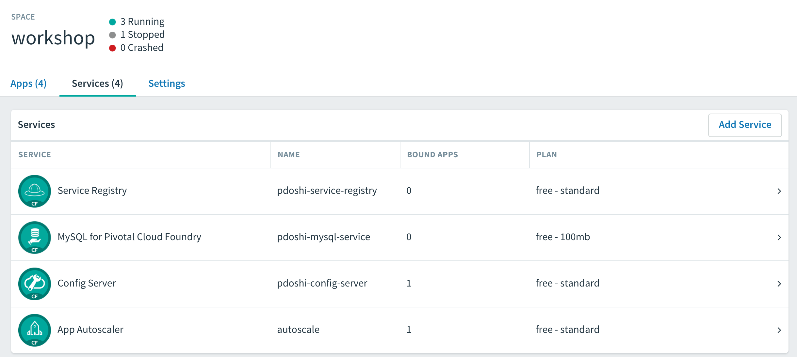 

.  Go to the command prompt and issue a *cf services* command and you should see your newly created MySQL and Service Registry service created and available.
+
[source, bash]
-----
pdoshi@Parags-MacBook-Pro:~/demos/AttendeeServicesApp$ cf services
Getting services in org PapaJohns / space workshop as pdoshi@pivotal.io...
OK

name                      service              plan       bound apps           last operation
autoscale                 app-autoscaler       standard   ddieruf-articulate   create succeeded
pdoshi-config-server      p-config-server      standard   pdoshi-scsapp        update succeeded
pdoshi-mysql-service      p-mysql              100mb                           create succeeded
pdoshi-service-registry   p-service-registry   standard                        create succeeded
-----

. Navigate to your AttendeeServiceApp folder and do a *cf push*. You should see the 'Binding...' service message. 
+
[source, bash]
-----
:
OK
Binding service pdoshi-mysql-service to app pdoshi-attendee-service in org PapaJohns / space workshop as pdoshi@pivotal.io...
OK
Binding service pdoshi-service-registry to app pdoshi-attendee-service in org PapaJohns / space workshop as pdoshi@pivotal.io...
OK
:

-----

. Ensure that your application has successfully started. Open a browser window and visit your application URL. In my example, it is pdoshi-attendee-service.cfapps.io. You need to have JSON formatter enabled as the app will show the /attendees endpoint information.

+
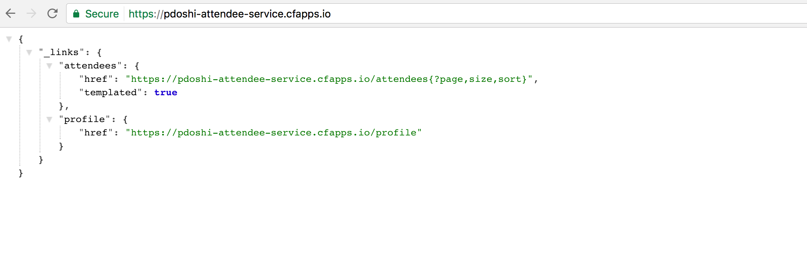 

. Now navigate to App Manager Services tab and you will see one app bound to your Eureka Service Registry and MySQL service.  

+
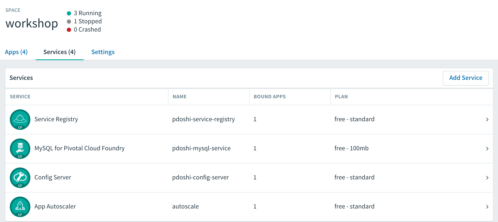 

. Click on your Service Registry service instance and it will show the attendee-service bound to the registry. 

+
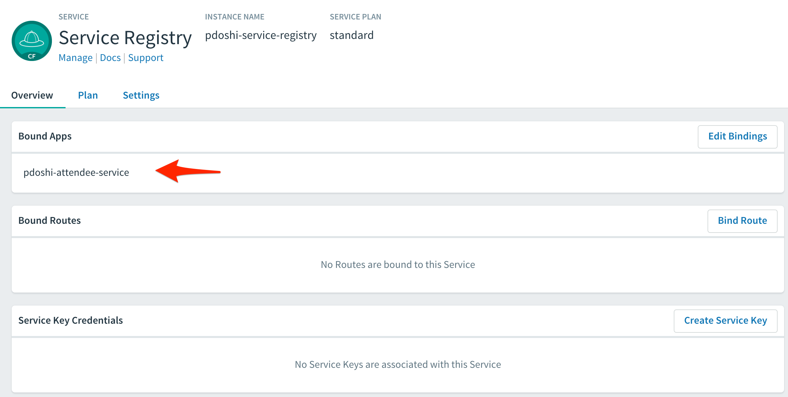

. Click on the 'Manage' link and it will open the Eureka Service Registry dashboard. You can see details of the service instance that is bound to the service registry.

+
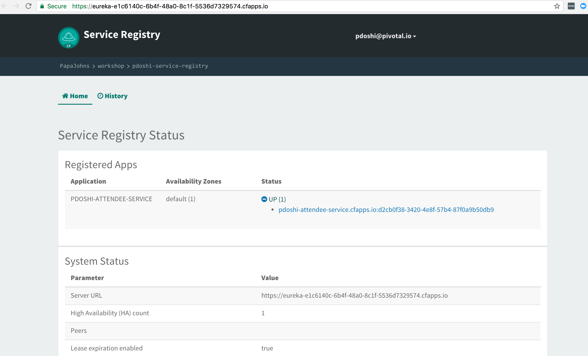

== Lookup Attendee Service and Invoke its Services

Now that we have successfully bound our Attendee micro service to the Service Registry, let's modify our SCSApp to lookup the service and invoke methods on it.

. Open the SCSApp's pom.xml and as before, we need to add _spring-cloud-services-starter-service-registry_ to the classpath

+
[source, xml]
---------------------------------------------------------------------
<dependency>
	<groupId>io.pivotal.spring.cloud</groupId>
	<artifactId>spring-cloud-services-starter-service-registry</artifactId>
	<version>1.4.1.RELEASE</version>
</dependency>

---------------------------------------------------------------------

. Since this UI is going to consume REST services its an awesome opportunity to use Feign.  Feign will handle *ALL* the work of invoking our services and marshalling/unmarshalling JSON into domain objects. As we will be working with JPA components, we will need to the Spring Data Rest dependency along with Feign Client dependencies in pom.xml. *Update your project so that dependency libraries are downloaded*.

+ 
[source, xml]
-----
<dependency>
	<groupId>org.springframework.boot</groupId>
	<artifactId>spring-boot-starter-data-rest</artifactId>
	<version>1.4.1.RELEASE</version>
</dependency>

<dependency>
	<groupId>org.springframework.cloud</groupId>
	<artifactId>spring-cloud-starter-feign</artifactId>
	<version>1.2.6.RELEASE</version>
</dependency>
-----

. Take note of how Feign references the downstream service; its only the name of the service it will lookup from Eureka service registry - *the name of the service should be the same name that you have previously bound your microservice in Service Registry*.  Add the following interface declaration to the */src/main/java/com.example.ScsworkshopApplication.java*:
+
[source,java]
---------------------------------------------------------------------
  2. @FeignClient("https://pdoshi-attendee-service")
3. 	protected interface AttendeeClient {
4. 
5. 		@RequestMapping(method=RequestMethod.GET, value="/attendees", consumes="application/hal+json")
6. 		Resources<Attendee> getAttendees();
7. 		
8. 		@RequestMapping(method=RequestMethod.POST, value="/attendees", consumes="application/hal+json")
9. 		Attendee save(Attendee attendee);
10. 	}
---------------------------------------------------------------------
+
We'll also need to add a few annotations to our boot application:
+
[source,java]
---------------------------------------------------------------------
@SpringBootApplication
@EnableFeignClients
@EnableDiscoveryClient
public class ScsworkshopApplication {
---------------------------------------------------------------------
+
Completed */src/main/java/com.example.ScsworkshopApplication.java* class:
+
[source,java]
---------------------------------------------------------------------
package com.example;

import com.example.model.Attendee;
import org.springframework.boot.SpringApplication;
import org.springframework.boot.autoconfigure.SpringBootApplication;
import org.springframework.cloud.client.discovery.EnableDiscoveryClient;
import org.springframework.cloud.netflix.feign.EnableFeignClients;
import org.springframework.cloud.netflix.feign.FeignClient;
import org.springframework.hateoas.Resources;
import org.springframework.web.bind.annotation.RequestMapping;
import org.springframework.web.bind.annotation.RequestMethod;

@SpringBootApplication
@EnableFeignClients
@EnableDiscoveryClient
public class ScsworkshopApplication {

	public static void main(String[] args) {
		SpringApplication.run(ScsworkshopApplication.class, args);
	}

	@FeignClient("https://pdoshi-attendee-service")
	protected interface AttendeeClient {
		@RequestMapping(method= RequestMethod.GET, value="/attendees", consumes="application/hal+json")
		Resources<Attendee> getAttendees();

		@RequestMapping(method=RequestMethod.POST, value="/attendees", consumes="application/hal+json")
 		Attendee save(Attendee attendee);
 	}
}

---------------------------------------------------------------------
. As we will be using the Feign client (AttendeeClient) in our REST methods, add the following instance variable in */src/main/java/com.example.ServicesController.java* and use AutoWired annotation so that Spring can inject an instance that will be used later.
+
[source, java, numbered]
-----
	ScsworkshopApplication.AttendeeClient client;

	@Autowired
	public ServicesController(ScsworkshopApplication.AttendeeClient _client)
	{
		client = _client;
	}
-----

. We will add a couple more REST endpoint methods in **/src/main/java/com.example.ServicesController.java** which will be invoked through UI interaction from */src/main/resources/template/services.html* file. 
+
Add the following two methods to **/src/main/java/com.example.ServicesController.java**:
+
[source, java, numbered]
-----
@RequestMapping("/services")
	public String services(HttpServletRequest request, Model model) throws Exception {
		Collection<Attendee> collection = new ArrayList<>();
		Resources<Attendee> results = client.getAttendees();
		if(results != null) {
		results.forEach(collection::add);
		}
		
		model.addAttribute("attendees", collection);
		model = clearAttendeeFormData(model);
		return "services";
		
	}

	@RequestMapping(value = "/save", method = RequestMethod.POST)
	public String save(HttpServletRequest request,@RequestParam("firstName") String firstName, @RequestParam("lastName") String lastName,
			@RequestParam("emailAddress") String emailAddress, Model model) throws Exception {

		Attendee attendee = new Attendee();
		attendee.setFirstName(firstName);
		attendee.setLastName(lastName);
		attendee.setEmailAddress(emailAddress);
		boolean addFailed = false;
		try {
			client.save(attendee);
		}
		catch(Exception e){
			addFailed = true;
			System.err.println("Failed to add attendee." + e);
			e.printStackTrace(System.err);
		}
		model.addAttribute("addFailed", addFailed);
		if(addFailed){
			model.addAttribute("firstName", firstName);
			model.addAttribute("lastName", lastName);
			model.addAttribute("emailAddress", emailAddress);
		}
		else{
			model = clearAttendeeFormData(model);
		}
		model.addAttribute("attendees", client.getAttendees());

		return "services";
	}
	
	private Model clearAttendeeFormData(Model model) {
		model.addAttribute("firstName", "");
		model.addAttribute("lastName", "");
		model.addAttribute("emailAddress", "");
		return model;
	}

-----
+
Completed */src/main/java/com.example.ServicesController.java* class:
+
[source, java]
-----
package com.example;

import javax.servlet.http.HttpServletRequest;

import com.example.model.Attendee;
import org.springframework.beans.factory.annotation.Autowired;
import org.springframework.cloud.context.config.annotation.RefreshScope;
import org.springframework.hateoas.Resources;
import org.springframework.stereotype.Controller;
import org.springframework.ui.Model;
import org.springframework.web.bind.annotation.RequestMapping;
import org.springframework.beans.factory.annotation.Value;
import org.springframework.web.bind.annotation.RequestMethod;
import org.springframework.web.bind.annotation.RequestParam;

import java.util.ArrayList;
import java.util.Collection;

@Controller
@RefreshScope
public class ServicesController {

	@Value("${greeting:Hi}")
	private String _greeting;

	ScsworkshopApplication.AttendeeClient client;

	@Autowired
	public ServicesController(ScsworkshopApplication.AttendeeClient _client)
	{
		client = _client;
	}

	@RequestMapping("/")
	public String index(HttpServletRequest request, Model model) throws Exception {
		model.addAttribute("greeting", _greeting);
		return "index";
	}

	@RequestMapping("/services")
	public String services(HttpServletRequest request, Model model) throws Exception {
		Collection<Attendee> collection = new ArrayList<>();
		Resources<Attendee> results = client.getAttendees();
		if(results != null) {
			results.forEach(collection::add);
		}

		model.addAttribute("attendees", collection);
		model = clearAttendeeFormData(model);
		return "services";

	}

	@RequestMapping(value = "/save", method = RequestMethod.POST)
	public String save(HttpServletRequest request, @RequestParam("firstName") String firstName, @RequestParam("lastName") String lastName,
					   @RequestParam("emailAddress") String emailAddress, Model model) throws Exception {

		Attendee attendee = new Attendee();
		attendee.setFirstName(firstName);
		attendee.setLastName(lastName);
		attendee.setEmailAddress(emailAddress);
		boolean addFailed = false;
		try {
			client.save(attendee);
		}
		catch(Exception e){
			addFailed = true;
			System.err.println("Failed to add attendee." + e);
			e.printStackTrace(System.err);
		}
		model.addAttribute("addFailed", addFailed);
		if(addFailed){
			model.addAttribute("firstName", firstName);
			model.addAttribute("lastName", lastName);
			model.addAttribute("emailAddress", emailAddress);
		}
		else{
			model = clearAttendeeFormData(model);
		}
		model.addAttribute("attendees", client.getAttendees());

		return "services";
	}

	private Model clearAttendeeFormData(Model model) {
		model.addAttribute("firstName", "");
		model.addAttribute("lastName", "");
		model.addAttribute("emailAddress", "");
		return model;
	}

}

-----

. Finally, we will update the manifest.yml to bind to the same Service Registry instance as our Attendee Service microservice. At this time you can remove the *config-server* service binding, as it is not needed in this lab.
+
[source, yml]
-----
services:
    - pdoshi-service-registry
-----
+
Completed *manifest.yml*:
+
[source, yml]
-----
applications:
- name: pdoshi-scsapp
  instances: 1
  memory: 1024M
  disk_quota: 1024M
  buildpack: java_buildpack
  path: target/scsapp-0.0.1-SNAPSHOT.jar
  stack: cflinuxfs2
  timeout: 180
  services:
    - pdoshi-service-registry
-----

== Deploy and test application

. Run the Maven *clean* and *package* tasks for the SCSApp application.  Do a *cf push* for the app from the command line. You should see 'Binding..' message for the service registry.
+
[source,bash]
---------------------------------------------------------------------
OK
Binding service pdoshi-service-registry to app pdoshi-scsapp in org PapaJohns / space workshop as pdoshi@pivotal.io...
OK
---------------------------------------------------------------------

. Test your application by navigating to the /services URL of the application, which will invoke the UI. In my example, the URL will be https://pdoshi-scsapp.cfapps.io/services. You should now see a section to add Attendees and the list of Attendee getting refreshed everytime we add an attendee:
+
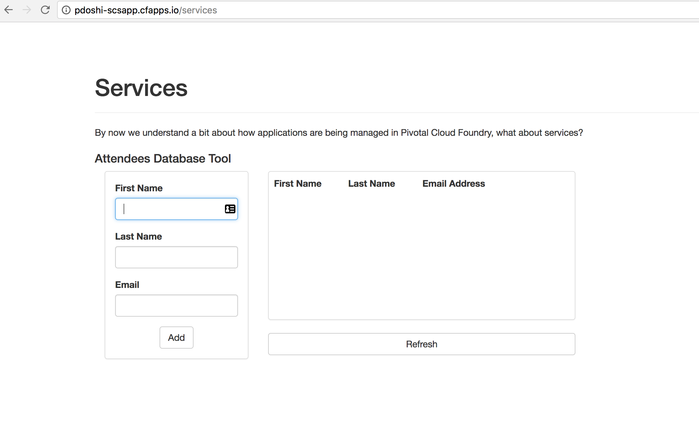

. After couple of attendees are created:

+
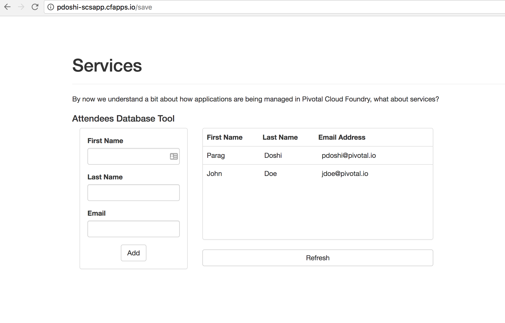

. From a commandline stop the attendee-service microservice
+
[source,bash]
---------------------------------------------------------------------
$ cf stop pdoshi-attendee-service
---------------------------------------------------------------------
. Refresh the browser.  What happens?  Now you get a nasty error that is not very user friendly!

+
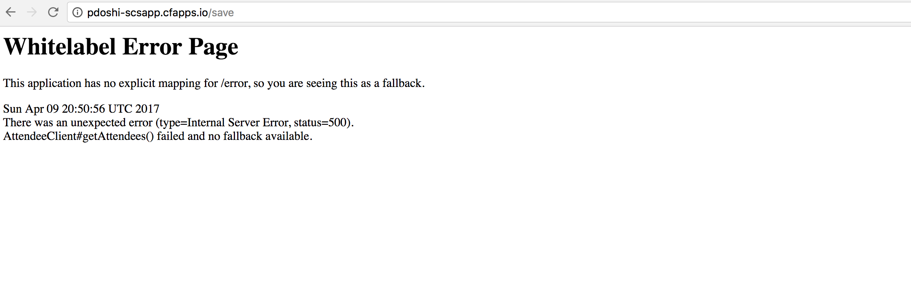

. Next we'll learn how to make our UI Application more resilient in the case that our downstream services are unavailable.

