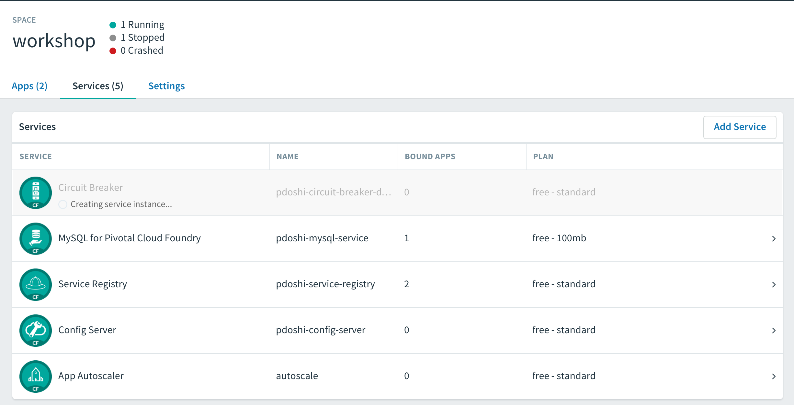
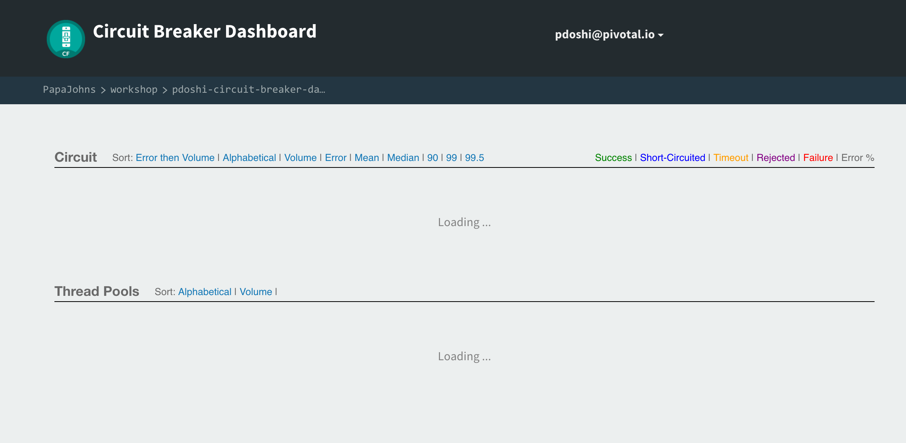
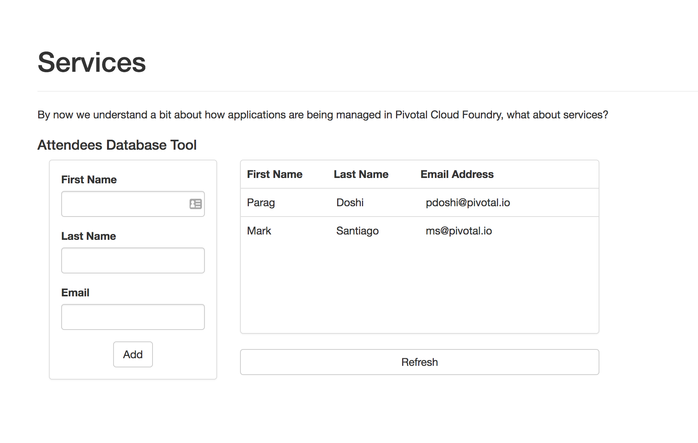
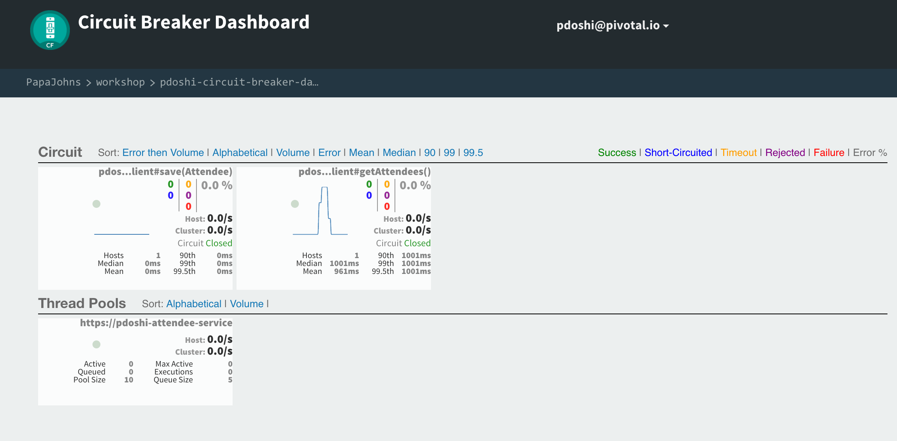

= Fault Tolerant Design with Spring Cloud Services - Hystrix

In this lab we'll utilize Spring Boot and Spring Cloud to make our SCSApp Application more resilient.  We'll leverage Spring Cloud Circuit Breaker to configure our application behavior when our downstream dependencies are not available.  Finally, we'll use the circuit break dashboard to view metrics of the circuit breaker we implemented, which will be auto-provisioned within Cloud Foundry Pivotal Spring Cloud Services.

== Define a Circuit Breaker within the _SCSApp Application_

. These features are added by adding _spring-cloud-services-starter-circuit-breaker_ to the classpath.  Open SCSApp's Maven *pom.xml*.  Add the following spring cloud services dependency:
+
[source, xml]
---------------------------------------------------------------------
<dependency>
	<groupId>io.pivotal.spring.cloud</groupId>
	<artifactId>spring-cloud-services-starter-circuit-breaker</artifactId>
	<version>1.4.1.RELEASE</version>
</dependency>
---------------------------------------------------------------------

. The first thing we need to add to our application is an @EnableCircuitBreaker annotation to the Spring Boot application. Add this annotation below the other ones on the ScsworkshopApplication declaration in the class ScsworkshopApplication.java:
+
[source, java]
---------------------------------------------------------------------
@SpringBootApplication
@EnableFeignClients
@EnableDiscoveryClient
@EnableCircuitBreaker
public class ScsworkshopApplication {
---------------------------------------------------------------------

. When we introduced an @FeignClient into our application we were only required to provide an interface.  We'll provide a dummy class that implements the AttendeeClient interface for our fallback.  We'll also reference that class as a fallback in our FeignClient annotion.  First, create this inner class in  *ScsworkshopApplication.java*:
+
[source, java, numbered]
---------------------------------------------------------------------
@Component
public class AttendeeClientFallback implements AttendeeClient {
@Override
	public Resources<Attendee> getAttendees() {
	//We'll just return an empty response
	return new Resources(Collections.EMPTY_LIST);
	}
	@Override
	public Attendee save (Attendee attendee) {
	//We'll just return an empty object
	return new Attendee();
	}
---------------------------------------------------------------------
+
. Also modify the _@FeignClient_ annotation to reference this class as the fallback in case of failure:
+
[source, java, numbered]
---------------------------------------------------------------------
@FeignClient("https://pdoshi-attendee-service", fallback = AttendeeClientFallback.class)
protected interface AttendeeClient {
---------------------------------------------------------------------
+
. Your Boot Application should now look like this ScsworkshopApplication_:
+
[source, java]
---------------------------------------------------------------------
package com.example;

import com.example.model.Attendee;
import org.springframework.boot.SpringApplication;
import org.springframework.boot.autoconfigure.SpringBootApplication;
import org.springframework.cloud.client.circuitbreaker.EnableCircuitBreaker;
import org.springframework.cloud.client.discovery.EnableDiscoveryClient;
import org.springframework.cloud.netflix.feign.EnableFeignClients;
import org.springframework.cloud.netflix.feign.FeignClient;
import org.springframework.hateoas.Resources;
import org.springframework.stereotype.Component;
import org.springframework.web.bind.annotation.RequestMapping;
import org.springframework.web.bind.annotation.RequestMethod;

import java.util.Collections;

@SpringBootApplication
@EnableFeignClients
@EnableDiscoveryClient
@EnableCircuitBreaker
public class ScsworkshopApplication {

	public static void main(String[] args) {
		SpringApplication.run(ScsworkshopApplication.class, args);
	}

	@FeignClient(name ="https://pdoshi-attendee-service", fallback = AttendeeClientFallback.class)
	protected interface AttendeeClient {
		@RequestMapping(method= RequestMethod.GET, value="/attendees", consumes="application/hal+json")
		Resources<Attendee> getAttendees();

		@RequestMapping(method=RequestMethod.POST, value="/attendees", consumes="application/hal+json")
 		Attendee save(Attendee attendee);
 	}

	@Component
	public class AttendeeClientFallback implements AttendeeClient {
		@Override
		public Resources<Attendee> getAttendees() {
			//We'll just return an empty response
			return new Resources(Collections.EMPTY_LIST);
		}
		@Override
		public Attendee save (Attendee attendee) {
			//We'll just return an empty object
			return new Attendee();
		}

	}
}

---------------------------------------------------------------------

== Create the Circuit Breaker Dashboard

.  When we modified our application to use a Hystrix Circuit Breaker our application automatically begins streaming out metrics about the health of our methods wrapped with a HystrixCommand.  We can stream these events through a AMQP message bus into Turbine to view on a Circuit Breaker dashboard.  This can be done through cloudfoundry using the services marketplace by executing the following command - ensure that you choose a unique prefix for the service name:
+
[source,bash]
---------------------------------------------------------------------
$ cf create-service p-circuit-breaker-dashboard standard pdoshi-circuit-breaker-dashboard
---------------------------------------------------------------------

. If we view the Services (accessible from the Apps Manager) you will see that the service is getting initialized:

+

. After the service is created, if we view the Circuit Breaker Dashboard (accessible from the _manage_ link in Apps Manager) you will see that a dashboard has been deployed but is empty (You may get an _initializing_ message for a few seconds.  This should eventually refresh to a dashboard):
+

. We will now bind our application to our circuit-breaker-dashboard within our Cloudfoundry deployment manifest.  Add the additional reference of circuit breaker dashboard to the services to the bottom of *manifest.yml* in the services list:
+
[source, yml]
---------------------------------------------------------------------
  services:
  - pdoshi-service-registry
  - pdoshi-circuit-breaker-dashboard
---------------------------------------------------------------------

== Deploy and test application

. Build the application using Maven *clean* and *package* targets. Push the application into Cloud Foundry using *cf push*

. Test your application by navigating to the root URL of the application.  If the dependent attendee-service REST service is still stopped, you should simply see an empty Attendee table.  Remember that last time you received a nasty exception in the browser?  Now your Circuit Breaker fallback method is automatically called and the fallback behavior is executed.
+
image::../../Common/images/circuit-breaker-fallback.png[]

. From a commandline start the attendee-service microservice
+
[source,bash]
---------------------------------------------------------------------
$ cf start pdoshi-attendee-service
---------------------------------------------------------------------

. Refresh the UI app and you should once again see the list of Attendees returned back from the service.
+

. Refresh your UI application a few times to force some traffic though the circuit breaker call path.  After doing this you should now see the dashboard populated with metrics about the health of your Hystrix circuit breaker:
+

